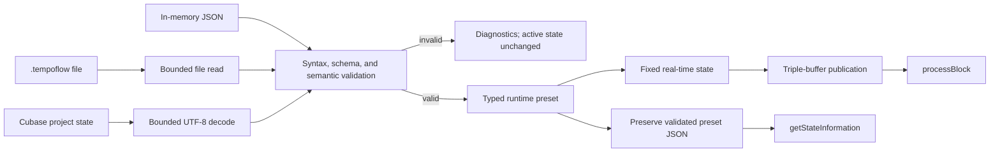

# Plug-in Preset State

TempoFlow uses the approved `.tempoflow` JSON document as its VST3 project state. A Cubase project therefore restores the same validated preset data that the PWA and command-line validator consume.

## Entry points

- `TempoFlowAudioProcessor::loadPresetFile` performs a bounded file read, validates the document, builds the typed runtime model, and applies it transactionally.
- `TempoFlowAudioProcessor::applyPresetJson` validates and applies an in-memory preset without file access.
- `getStateInformation` returns the complete validated UTF-8 preset JSON to the host.
- `setStateInformation` validates host-provided state before publishing it.
- `getLastPresetErrors` returns diagnostics from the most recent failed load or restore operation.

The headless plug-in intentionally relies on the host for native `.vstpreset` selection and saving. VST3 project save and restore already use the standard JUCE state callbacks. The `.tempoflow` loading API supports internal tooling and factory-preset generation; any future direct interchange-file import is separate from the standard host-managed preset workflow.

`TempoFlowVst3PresetGenerator` loads the built VST3 module, locates its audio component and immutable processor class ID, applies each validated reference JSON through `IComponent::setState`, and serializes the result with Steinberg's `PresetFile` helper. It then loads every generated container into a fresh component and compares the restored JSON state before writing the file. This exercises the same JUCE VST3 state wrapper that Cubase uses instead of duplicating its binary representation.

## State flow

## Transaction and failure rules

- The active preset changes only after the complete document passes validation and conversion.
- Invalid JSON, unsupported schema versions, semantic errors, invalid UTF-8, embedded null bytes, empty state, and state larger than 1 MiB are rejected.
- File-load diagnostics include the full source path and the violated rule.
- Unknown optional fields remain in the preserved JSON and survive project-state round trips.
- A failed file load or host-state restore leaves the active audio and persistent state unchanged.

## Real-time publication

Parsing, file access, diagnostics, strings, and dynamic containers remain outside `processBlock`. A validated preset is converted to a fixed-size real-time representation containing only the beat-role table and master volume.

The processor publishes this representation through three preallocated slots. The audio callback copies a stable slot only when its generation changes. It does not allocate, free, lock, wait, access files, parse JSON, or report diagnostics.

Applying a new generation resets the scheduler and click tails at the next audio block. This prevents audio from the previous preset from leaking into the new state.

## Playback semantics

- Host tempo, transport, position, and time signature remain authoritative.
- The preset selects the click role for each defined beat and supplies the master volume.
- `mute` produces silence.
- A host beat outside the loaded preset's pattern range produces silence. TempoFlow does not invent pattern expansion when the host meter differs from the preset meter.
- Grouping-driven accents and audible triplet subdivisions remain separate playback work. Their musical behavior must be approved before implementation.
